# Unity toy projects

## AutomobileRace
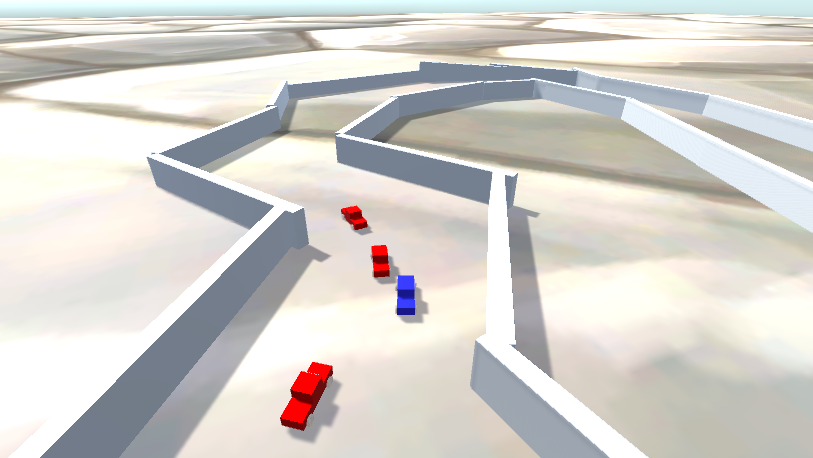
- transform
- object tree
- simple raycast

## 04FlappyBird
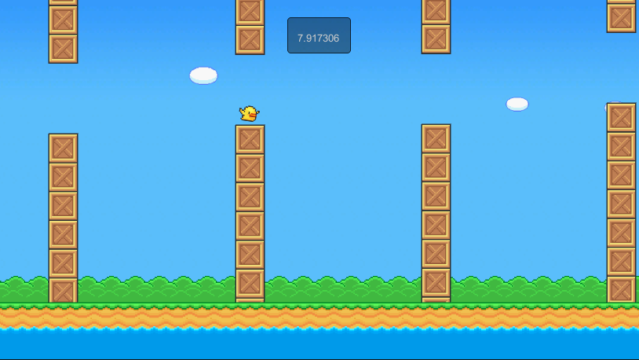
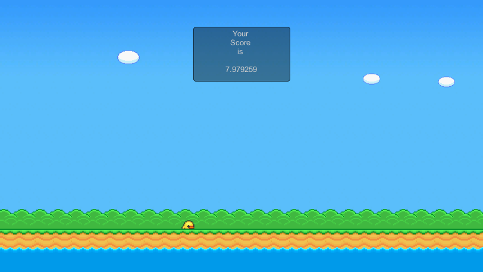
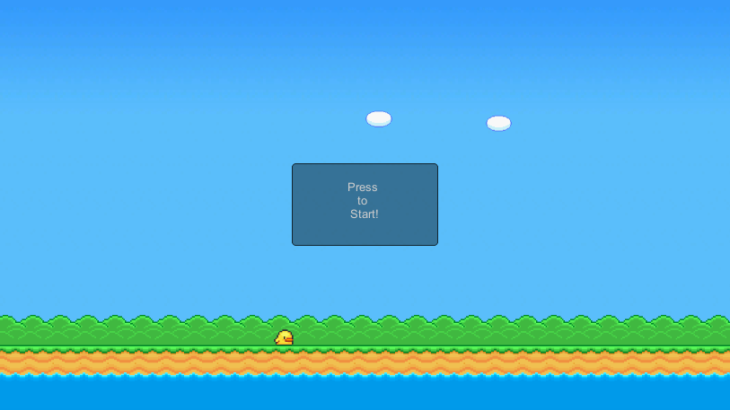
- rigidbody
- collision & trigger

## 07LegacyAnim
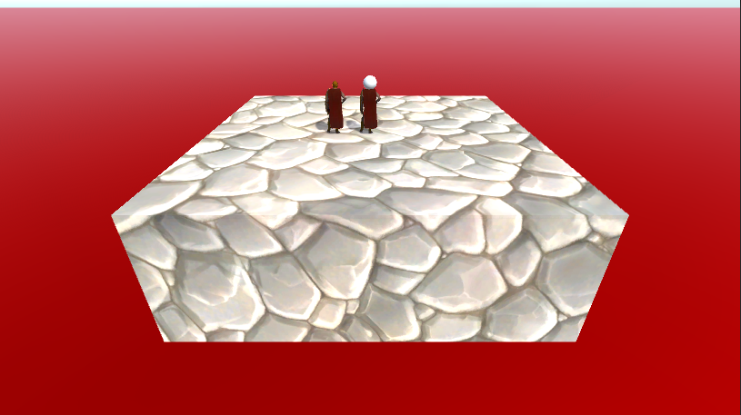
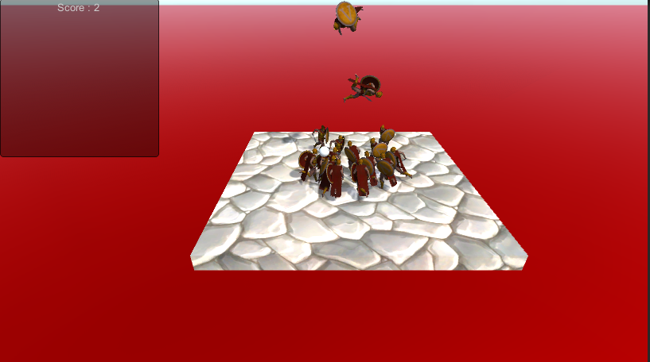
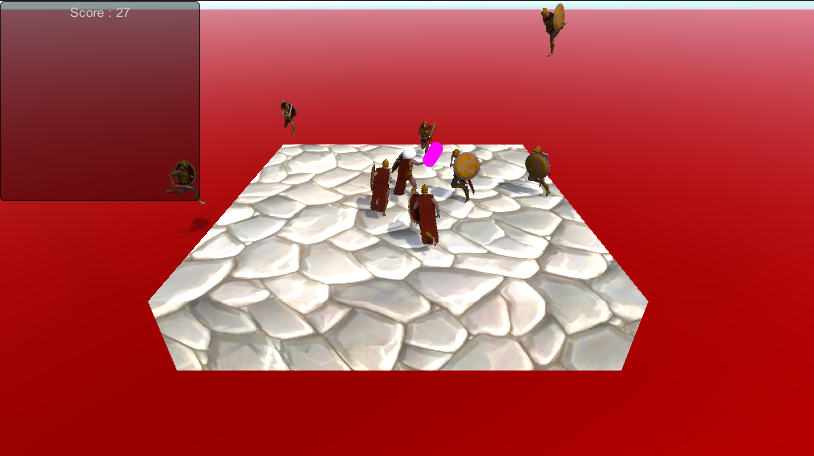
- animation (legacy)

## 08Project2D
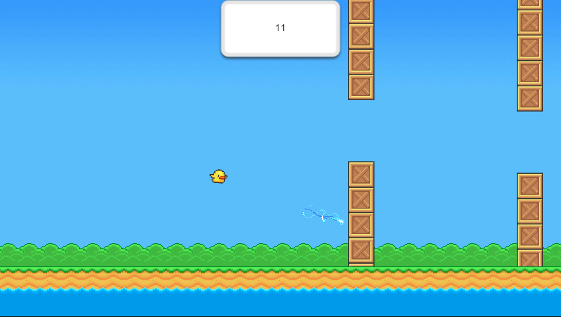
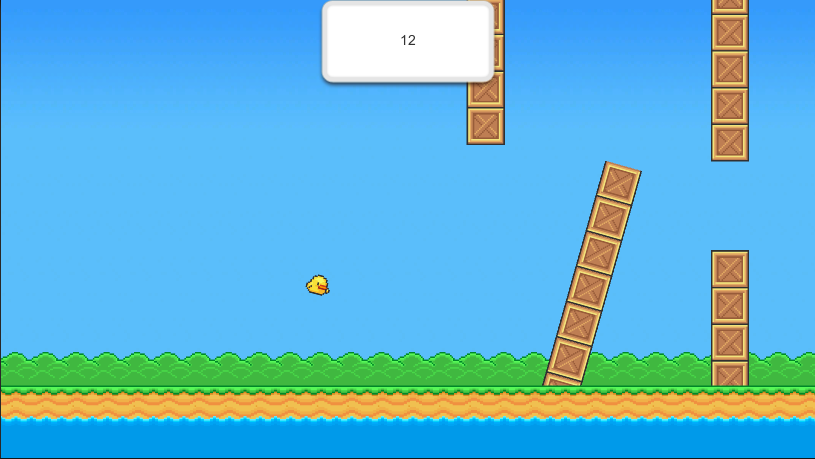
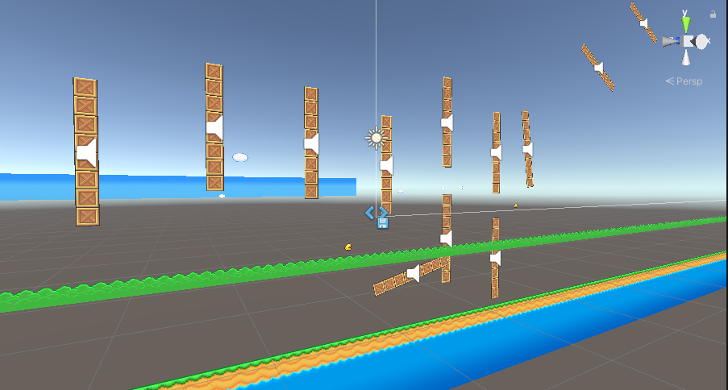
- UI
- 2D
- sprite & simple animator

## 09Mecanim
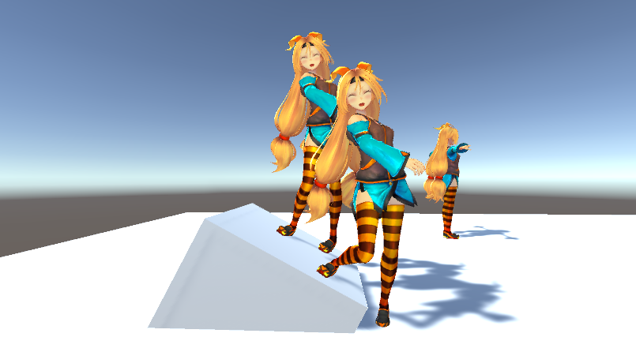
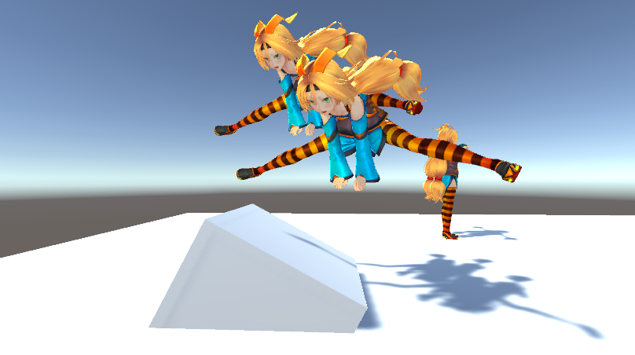
- animator
- Inverse Kinematic

## Snowgame
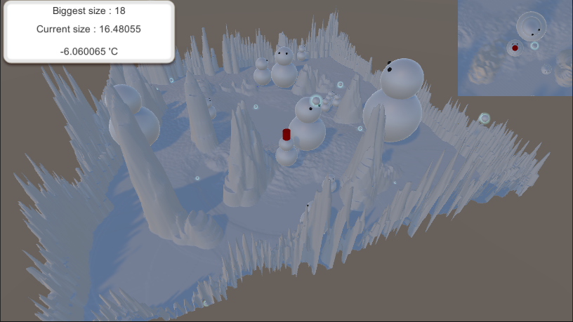
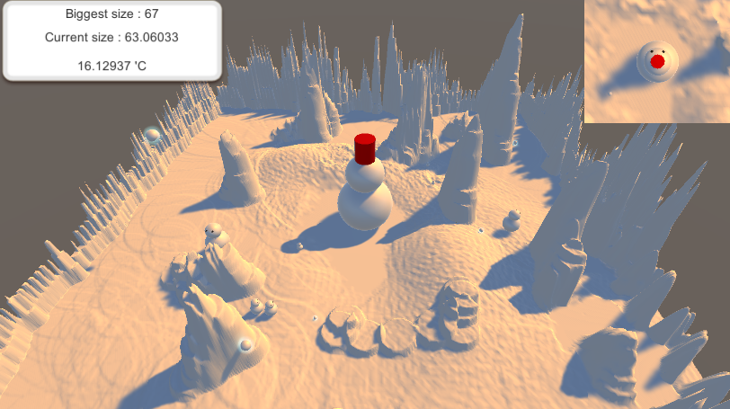
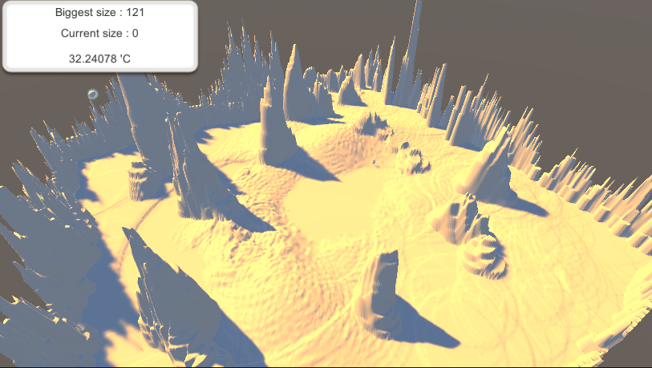
- terrain
- navmesh